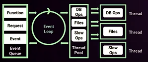

# Curso de Fundamentos de Node.js

Por: **Carlos Hernandez**

Redes: [@CodingCarlos]()

## Conocer los conceptos básicos de Node.js

### 1. Instalación de Node.js

[Sitio web: nodejs.org](https://nodejs.org/)

- Descargar la versión según el sistema operativo e instalar siguiendo las instrucciónes.
- Luego en consola:
  - `node -v`, para ver si se instaló correctamente y su versión
  - `npm -v`, para ver la versión de NPM instalado (se instala con Node.js)

### 2. Node: orígenes y filosofía

#### ¿Que es Node.js?

- Es un entorno de ejecución de JavaScript fuera del navegador.
- Se crea en 2009, está orientado a servidores.

#### Fuera del navegador

- No necesita del navegador para ejecutar JavaScript
- Servidores
- Herramientas: transpiladores, scraping, automatización, IoT, etc.

#### Lenguaje concurrente

- Monohilo, con entradas y salidas asíncronas
- Un proceso por cada núcleo del procesador, no es bloqueante

#### Corre sobre el motor V8

- V8, entorno de ejecución de JavaScript creado por Google y libre desde el 2008
- Escrito en C++
- Convierte JavaScript en código máquina en lugar de interpretarlo en tiempo real

#### Funciona en base a módulos

- Todo lo que no sea sintaxis de programación, son módulos.
- Muchos módulos vienen por defecto en el paquete de node.
- Se puede crear módulos propios.

#### Orientado a eventos

- Hay un bucle de eventos que se ejecuta constantemente.
- Puede orientar tu código de forma reactiva.

### 3. Event Loop: asincronía por diseño



#### Event Loop (bucle de eventos)

Un proceso con un bucle que gestiona, de forma asíncrona, todos los eventos de tu aplicación. El bucle no se bloquea, todo lo que se envía se ejecuta.

#### Event Queue (cola de eventos)

Tiene todos los eventos del código, puede ser una función, request, event, etc. El **Event Queue** envía estos eventos al **Event Loop**, el cual resuelve cada evento inmediatamente, en caso no lo pueda resolver inmediatamente lo envía al **Thread Pool**.

#### Thread Pool (grupo de subprocesos)

Aquí se gestionan las operaciones asíncronas, como por ejemplo: DB Ops, files, slow Ops, etc. lo cual permite que el *Event Loop* no se bloquee. El *Thread Pool* abre un hilo por cada operación y esta se ejecutará en un determinado tiempo, mientras el *Event Loop* continua funcionando.

### 4. Monohilo: implicaciones en diseño y seguridad

**Proceso de node:**

1. Va a abrirse un proceso, ese proceso es un proceso de node    
2. Interpreta todo el archivo    
3. Convertirlo a código maquina    
4. Prepara todo lo que necesita para ejecutarse   
5. Se ejecuta    
6. Se cierra el proceso, y termina 

**Desventaja del Monohilo:**

- Si no se manejan bien los errores y uno truena, ya no continua con los procesos posteriores
- Se debe estar pendiente de todo el código y manejar bien los errores

```js
//./conceptos/monohilo.js
console.log('Hola mundo!');

let i = 0;
setInterval(() => {
    console.log(i);
    i++;
    if (i === 5){
        let m = i + z;
    }
}, 1000);

console.log('Segunda instrución');
```

Al ejecutar el código en consola usamos `node ./conceptos/monohilo.js`:

```bash
Hola mundo!
Segunda instrución
0
1
2
3
4
...\monohilo.js:8
        let m = i + z;
                    ^
ReferenceError: z is not defined

```

Observamos que primero se ejecutan los `console.log()`, ya que el `setInterval()`, necesita un tiempo para ejecutarse, por lo que el *Event Loop* funciona de manera asíncrona delegando esta tarea al *Thread Pool*.

Por otro lado, al haber un error, la ejecución del código se detiene justo cuando `i = 5`.

### 5. Configurar las variables de entorno en Node.js

Las variables de entorno sirven para definir parámetros sencillos de configuración de los programas, de modo que éstos puedan ejecutarse en diferentes ambientes sin necesidad de modificar el código fuente de un script.

Son útiles en diversos casos del desarrollo en general, pero muy habituales en el desarrollo web porque en la mayoría de las ocasiones los programas se deben ejecutar en diferentes ordenadores. Por ejemplo, durante la etapa de desarrollo puede que tengamos unas configuraciones de entorno y cuando se ponga el programa en producción éstas cambien.

#### Crear variables de entorno

El módulo principal `process` de Node.js proporciona la propiedad `env` la cual almacena todas las variables de entorno que fueron definidas al momento que empezó el proceso.

El siguiente código corre `app.js` estableciendo `USER_ID` y`USER_KEY`.

```bash
BASHcopy
USER_ID=239482 USER_KEY=foobar node app.js
```

Esto pasará el `USER_ID` como **239482** y el `USER_KEY` como **foobar**. Esto es apropiado para *testing*, sin embargo para *production*, probablemente sea mejor configurar *BASH scripts* para exportar las variables.

> `process` no requiere el uso de "require", porque está automáticamente disponible.

En el siguiente código se accede a las variables de entorno `USER_ID` y`USER_KEY` que fueron establecidas previamente.

```js
JScopy
let userID = process.env.USER_ID // "239482"
let userKey = process.env.USER_KEY // "foobar"
```

De la misma manera se puede acceder a cualquier variable de entorno configurada.

Lo que puede ocurrir es que las variables de entorno no siempre se hayan definido, por lo que es útil que en nuestro programa les asignemos unos valores predeterminados. Esto lo podemos conseguir con un código como este:

```js
JScopy
let userID = process.env.USER_ID || 'defaultUserID'
let userKey = process.env.USER_KEY || 'defaultUserKey'
```

Si en un proyecto de Node.js se tiene muchas variables de entorno, se puede crear un archivo `.env` en el directorio raíz del proyecto, y luego usar el paquete [dotenv](https://www.npmjs.com/package/dotenv) para cargar las variables durante el tiempo de ejecución (runtime).

```bash
BASHcopy
# .env file
USER_ID="239482"
USER_KEY="foobar"
NODE_ENV="development"
```

En el archivo de JavaScript

```js
JScopyrequire('dotenv').config();
process.env.USER_ID // "239482"
process.env.USER_KEY // "foobar"
process.env.NODE_ENV // "development"
```

> También se puede correr el archivo JavaScript con el comando `node -r dotenv/config index.js` si no se quiere importar el paquete en el código.

### 6. Herramientas para ser más felices: Nodemon y PM2

[Nodemon](https://nodemon.io/), herramienta que al detectar cambios en los archivos relacionados, ejecuta el código automáticamente. Se usa en desarrollo.

Para instalar se puede hacer desde bash usando npm: `npm install -g nodemon`

[PM2](https://pm2.keymetrics.io/), para usar en producción. Es una herramienta similar a nodemon, sin embargo tiene otras funcionalidades mas avanzadas. Nos ayuda a administrar y mantener una aplicación 24/7.

Se puede instalar de manera global: `npm install -g pm2`

## Cómo manejar la asincronía

### 7. Callbacks

Una funcion callback es una funcion que es pasada como argumento a otra funcion, para ser llamada(`called back`) en otro momento.
La funcion que recibe como argumento otras funciones es denominada funcion de orden superior (higher-order function), esta contiene la logica correspondiente para ejecutar adecuadamente la funcion callback.

En el siguiente codigo

```javascript
setTimeout(() => {
    console.log('Hello');
}, 1000)
```

`setTimeout` es una higher-order function y tiene un callback function que se ejecutará luego del tiempo indicado.

### 8. Callback Hell: refactorizar o sufrir

Los callback Hell se dan cuando empiezo a pasar una función como parámetro que a su vez llama a otra función como parámetro, y así hasta n.
Una estrategia para trabajar con estas estructuras lógicas tan monolíticas es usar estructuras de control y funciones recursivas.

Las funciones recursivas se llaman así mismas y mediante la estructura de control le digo cuantas veces voy a necesitar llamar la función así misma.

```js
function hola (nombre, callback){
    setTimeout(() => {
        console.log(`Hola ${nombre}...`);
        callback(nombre);
    }, 1000);
}

function adios (nombre, callback){
    setTimeout(() => {
        console.log(`Adios ${nombre}`);
        callback();
    }, 1000);
}

function hablar (callback){
    setTimeout(() => {
        console.log('Bla bla bla...');
        callback();
    }, 1000);
}

//callbackHell
//Queremos ejecutar hablar() varias veces
/*console.log('Iniciando...');
hola('Rem', function(nombre){
    hablar(function(){
        hablar(function(){
            hablar(function(){
                hablar(function(){
                    adios(nombre, function(){
                        console.log('Finalizando');
                    });
                });
            });
        });
    });
}); */

//Solución al callback hell
function conversacion (nombre, veces, callback){
    if(veces > 0){
        hablar(function(){
            conversacion(nombre, --veces, callback);
        })
    } else {
        adios(nombre, callback);
    }

}

console.log('Iniciando....');
hola('Rem', function(nombre){
    conversacion(nombre, 4, function(){
        console.log('Terminado.....');
    })
});
```

### 9. Promesas

Las promesas son una sintaxis mas elegante y legible de realizar callbacks, creando así un código mucho más escalable y entendible para todas las personas.
Una promesa al final no deja de ser un callback, solo que, con la novedad de tener estados, las promesas cuentan con 3 estados, *resuelta*, en *progreso* y en *fallo*.
Para utilizar una promesa solo debemos de instanciar una nueva, una promesa en si es una función que recibe dos parámetros, resolve y reject, que son los dos estados de una promesa.
Utilizamos resolve para retornar el valor deseado cuando una función se ejecute y utilizamos reject para cuando una función retorna un valor no deseado.

```js
New Promise( (resolve, reject) => {
    //code
    if(code === true){
    	resolve(correctValue);
    }else {
    	reject(wrongValue);
    }
});
```

Para poder obtener los valores que retorna una función debemos utilizar su propiedad `.then`, esta propiedad es una función que recibe un callback el cual tendrá como parámetro el valor retornado con resolve o reject.
Siempre que usemos una promesa además de realizar la propiedad `.then` debemos invocar la propiedad `.catch`, la cual es un callback que recibe como parámetro el error ocurrido en caso de haber sucedido uno.

```js
myPromise(‘Parameter’)
	.then( data => console.log(data))
	.catch( err => console.log(err) );
```

### 10. Async / await

Asyn/Await es azucar sintactico, es decir, una forma muy legible y entendible de realizar código, un Async/Await no deja de ser una función asíncrona, la diferencia es que al usar esta sintaxis se podrá ver un código más legible.
Para usar correctamente esta sintaxis usamos Async para declarar una función asíncrona, cuando una función es asíncrona podremos usar dentro de su contexto el Await.
El Await es la manera en que le indicaremos a nuestro código que ha de “esperar” a que el evento al cual le indiquemos. Await es importante para el proceso del código, por ende, para poder seguir ejecutando el proceso espere a que el evento se resuelva y retorne un valor.
Cuando este retorne un valor el código seguirá normalmente.

```js
function resolveAfter2Seconds() {
  return new Promise(resolve => {
    setTimeout(() => {
      resolve('resolved');
    }, 2000);
  });
}

async function asyncCall() {
  console.log('calling');
  const result = await resolveAfter2Seconds();
  console.log(result);
  // expected output: "resolved"
}

asyncCall();
```

> En informática, el azúcar sintáctico es un término acuñado por Peter J. Landin en 1964 para referirse a los añadidos a la sintaxis de un lenguaje de programación diseñados para hacer algunas construcciones más fáciles de leer o expresar. Esto hace el lenguaje “más dulce” para el uso por programadores: las cosas pueden ser expresadas de una manera más clara, más concisas, o de un modo alternativo que se prefiera, sin afectar a la funcionalidad del programa.

## Entender los módulos del core

### 11. Globals

En el navegador el objeto global es **window**. **this** hace referencia a **windows**.

En Node.js el objeto global es **global**. **this** hace referencia a **global**.

En node tenemos el objeto **global** que contiene los métodos y propiedades básicas que usamos en node.js.

En node `this` es un alias de `global`

Algunos métodos que se incluyen en el objeto **global** son:

- `setTimeout`: ejecuta una función callback después de un tiempo determinado
- `setInterval`: ejecuta una función callback cada cierto tiempo
- `setImmediate`: ejecuta una función callback inmediatamente, como un *setTimeout* con tiempo de 0. Por lo tanto es asíncrona, se ejecutará luego que el hijo esté libre.
- `clearTimeout`: detiene a una función **setTimeout**
- `clearInterval`: detiene a una función **setInterval**

>  En Node.js, cada archivo es tratado como un módulo.

Hay variables en Node.js que pueden parecer globales, pero no lo son, estas variables existen solo en el *scope* del módulo:

- `__dirname` el directorio del módulo
- `__filename` el archivo del módulo
- `exports` hace referencia al exportar el módulo actual
- `module` hace referencia al módulo actual
- `require()` usado para importar módulos, json y otros archivos locales.

### 12. File system

The Node.js file system module allows you to work with the file system on your computer.

To include the File System module, use the `require()` method:

```js
var fs = require('fs');
```

 Common use for the File System module:

- Read files
- Create files
- Update files
- Delete files
- Rename files

#### Read files

The `fs.readFile()` method is used to read files on your computer.

#### Create files

The File System module has methods for creating new files:

- `fs.appendFile()`
- `fs.open()`
- `fs.writeFile()`

The `fs.appendFile()` method appends specified content to a file. If the file does not exist, the file will be created.

```js
var fs = require('fs');

fs.appendFile('mynewfile1.txt', 'Hello content!', function (err) {
  if (err) throw err;
  console.log('Saved!');
});
```


The `fs.open()` method takes a "flag" as the second argument, if the flag is "w" for "writing", the specified file is opened for writing. If the file does not exist, an empty file is created.

```js
var fs = require('fs');

fs.open('mynewfile2.txt', 'w', function (err, file) {
  if (err) throw err;
  console.log('Saved!');
});
```


The `fs.writeFile()` method replaces the specified file and content if it exists. If the file does not exist, a new file, containing the specified content, will be created.

```js
var fs = require('fs');

fs.writeFile('mynewfile3.txt', 'Hello content!', function (err) {
  if (err) throw err;
  console.log('Saved!');
});
```

#### Update files

The File System module has methods for updating files:

- `fs.appendFile()`
- `fs.writeFile()`

The `fs.appendFile()` method appends the specified content at the end of the specified file:

```js
var fs = require('fs');

fs.appendFile('mynewfile1.txt', ' This is my text.', function (err) {
  if (err) throw err;
  console.log('Updated!');
});
```

The `fs.writeFile()` method replaces the specified file and content:

```js
var fs = require('fs');

fs.writeFile('mynewfile3.txt', 'This is my text', function (err) {
  if (err) throw err;
  console.log('Replaced!');
});
```

#### Delete files

To delete a file with the File System module, use the `fs.unlink()` method.

The `fs.unlink()` method deletes the specified file:

```js
var fs = require('fs');

fs.unlink('mynewfile2.txt', function (err) {
  if (err) throw err;
  console.log('File deleted!');
});
```

#### Rename files

To rename a file with the File System module, use the `fs.rename()` method.

The `fs.rename()` method renames the specified file:

```js
var fs = require('fs');

fs.rename('mynewfile1.txt', 'myrenamedfile.txt', function (err) {
  if (err) throw err;
  console.log('File Renamed!');
});
```

### 13. Console

El objeto `console` nos permite pasar información a la consola y lo podemos usar según el tipo de información que queremos transmitir:

- `console.log()` para pasar cualquier tipo de información a la consola
- `console.info()` para enviar información sobre algo
- `console.error()` para mostrar un error
- `console.warn()` usado para mostrar una advertencia
- `console.count()` para mostrar un contador auto incremental
- `console.countReset()` para reiniciar el contador
- `console.time()` para iniciar un cronómetro en milisegundos
- `console.timeEnd()` para finalizar el cronómetro
- `console.group()` permite agrupar información en la consola
- `console.groupEnd()` finaliza la agrupación
- `console.clear()` para limpiar la consola

### 14. Errores (try / catch)

La declaración **`try...catch`** señala un bloque de instrucciones a intentar (**`try`**), y especifica una respuesta si se produce una excepción (**`catch`**).

```js
try {
  nonExistentFunction();
} catch (error) {
  console.error(error);
  // expected output: ReferenceError: nonExistentFunction is not defined
  // Note - error messages will vary depending on browser
}
```

#### Sintaxis

```js
try {
   try_statements
}
[catch (exception_var_1 if condition_1) { // non-standard
   catch_statements_1
}]
...
[catch (exception_var_2) {
   catch_statements_2
}]
[finally {
   finally_statements
}]
```

- `try_statements`

  Las sentencias que serán ejecutadas.

- `catch_statements_1`, `catch_statements_2`

  Sentencias que se ejecutan si una excepción es lanzada en el bloque `try`.

- `exception_var_1`, `exception_var_2`

  Identificador que contiene un objeto de excepcion asociado a la cláusula `catch`.

- `condition_1`

  Una expresión condicional.

- `finally_statements`

  Sentencias que se ejecutan después de que se completa la declaración `try` . Estas sentencias se ejecutan independientemente de si una excepción fue lanzada o capturada.

#### Descripción

La sentencia `try` consiste en un bloque `try` que contiene una o más sentencias. Las llaves `{}` se deben utilizar siempre`,` incluso para una bloques de una sola sentencia. Al menos un bloque `catch` o un bloque `finally` debe estar presente. Esto nos da tres formas posibles para la sentencia `try`:

1. `try...catch`
2. `try...finally`
3. `try...catch...finally`

Un bloque `catch` contiene sentencias que especifican que hacer si una excepción es lanzada en el bloque `try`. Si cualquier sentencia dentro del bloque `try` (o en una funcion llamada desde dentro del bloque `try`) lanza una excepción, el control cambia inmediatamente al bloque `catch` . Si no se lanza ninguna excepcion en el bloque `try`, el bloque `catch` se omite.

La bloque `finally` se ejecuta despues del bloque `try` y el/los bloque(s) `catch` hayan finalizado su ejecución. Éste bloque siempre se ejecuta, independientemente de si una excepción fue lanzada o capturada.

Puede anidar una o más sentencias `try`. Si una sentencia `try` interna no tiene una bloque `catch`, se ejecuta el bloque `catch` de la sentencia `try` que la encierra.

#### Bloques catch condicionales

También se pueden crear "bloques `catch` condicionales", combinando bloques `try...catch` con estructuras `if...else if...else` como estas:

```js
try {
    myroutine();  // puede lanzar tres tipos de excepciones
} catch (e) {
    if (e instanceof TypeError) {
        // sentencias para manejar excepciones TypeError
    } else if (e instanceof RangeError) {
        // sentencias para manejar excepciones RangeError
    } else if (e instanceof EvalError) {
        // sentencias para manejar excepciones EvalError
    } else {
       // sentencias para manejar cualquier excepción no especificada
       logMyErrors(e); // pasa el objeto de la excepción al manejador de errores
}
```

---

Cuando sucede un error y no es manejado adecuadamente en Node.js, la aplicación y posterior ejecución del código se detiene.

Cada hilo funciona de manera independiente, por lo que en funciones asíncronas el error debe ser manejado dentro de las mismas, ya que estas pasarán a resolverse en el **Thread Pool** y el error se mandará desde allí hacia el hilo principal y detendrá la aplicación.

```js
//Capturan el error en una función
function main (){
    return 1 + x;
}

try{
    main();
} catch (err){
    console.error('Algo salio mal...');
    console.error(err.message);
}

//El error es capturado y se propaga hacia la función raíz
function foo (){
    myFunc();
}

function myFunc(){
    return 1 + y;
}

try {
    foo();
} catch (e){
    console.error('HUBO UN ERRO');
    console.error(e.message);
}

//En funciones asincronas se debe hacer try y catch en
//la función asincrona, ya que no pasan directamente al
//hilo principal
function asyncrona (callback){
    setTimeout(function(){
        try {
            return 1 + z;
        } catch (e){
            console.error('Hubo error en la función asíncrona...');
            callback(e);
        }
    }, 1000);
}

try {
    asyncrona(function(err){
        console.log(err.message);
    });
} catch (e){
    console.error('Hubo un error');
    console.error(e);
}
```

### 15. Procesos hijo (child_process)

El módulo de procesos secundarios de Node.js (**child_process**) tiene funciones **spawn** y **exec**, mediante las cuales podemos iniciar un proceso secundario para ejecutar otros programas en el sistema.

La diferencia más significativa entre child_process.spawn y child_process.exec está en lo que spawn devuelve un stream y exec devuelve un buffer.

- Usa **spawn** cuando quieras que el proceso hijo devuelva datos binarios enormes a Node.
- Usa **exec** cuando quieras que el proceso hijo devuelva mensajes de estado simples.
- Usa **spawn** cuando quieras recibir datos desde que el proceso arranca.
- Usa **exec** cuando solo quieras recibir datos al final de la ejecución.

#### exec

```js
const { exec } = require('child_process');

exec('cat *.js missing_file | wc -l', (error, stdout, stderr) => {
  if (error) {
    console.error(`exec error: ${error}`);
    return;
  }
  console.log(`stdout: ${stdout}`);
  console.error(`stderr: ${stderr}`);
});
```

#### spawn (generar)

Ejecutar `ls -lh /usr` y capturar `stdout`, `stderr` y cerrar el proceso:

```js
const { spawn } = require('child_process');

const ls = spawn('ls', ['-lh', '/usr']);

ls.stdout.on('data', (data) => {
  console.log(`stdout: ${data}`);
});

ls.stderr.on('data', (data) => {
  console.error(`stderr: ${data}`);
});

ls.on('close', (code) => {
  console.log(`child process exited with code ${code}`);
});
```

### 16. Módulos nativos en C++

JavaScript permite hacer uso de módulos nativos de c++. Para lograr esto debemos instalar `sudo npm i -g node-gyp`, este modulo de npm nos permite compilar módulos nativos de c++ en node.

Luego debemos tener listo nuestro archivo de código fuente en c++ junto a otro archivo .gyp, que nos ayudara hacer la compilación a JavaScript.

En este archivo .gyp le indicamos que va compilar, como se va llamar el archivo resultante y de donde va a tomar la info a convertir, todo esto lo dejamos como un json

```json
{
  "targets": [
    {   
      "target_name": "addon",
      "sources": [ "hola.cc" ]
    }
  ]
}
```

luego le decimos a node que configure este modulo, con le comando `node-gyp configure`, como resultado tendremos en un directorio nuevo donde se encontraran diferentes archivos de código nativo, para finalizar con `node-gyp build` creamos nuestro modulo y estará listo para ser usado.

### 17. HTTP

Node nos ofrece el modulo HTTP el cual nos permite principalmente crear un servidor en nuestro computador.
En este modulo encontraremos todo lo necesario que necesitamos para crear un sistema de rutas, que responderá cada ruta, los header que podrá mandar, etc.
Uno de los métodos principales de este modulo es createServer, el cual nos permitirá abrir un puerto para crear el servidor.

```js
const http = require('http');

// Create a local server to receive data from
const server = http.createServer((req, res) => {
  res.writeHead(200, { 'Content-Type': 'application/json' });
  res.end(JSON.stringify({
    data: 'Hello World!'
  }));
});

server.listen(8000);
```

O también se puede crear de la siguiente forma:

```js
const http = require('http');

// Create a local server to receive data from
const server = http.createServer();

// Listen to the request event
server.on('request', (request, res) => {
  res.writeHead(200, { 'Content-Type': 'application/json' });
  res.end(JSON.stringify({
    data: 'Hello World!'
  }));
});

server.listen(8000);

```

### 18. OS

El modulo de OS, Operative System, nos permite ejecutar acciones de más bajo nivel en nuestro sistema, permitiéndonos conocer una gran variedad de detalles del mismo.
Como la memoria disponible que tiene, el total de la memoria, la interfaz de red, etc.
Esto nos será de gran ayuda a la hora de ejecutar o crear proyectos que necesiten información de una maquina para ejecutar una operación.

Podemos acceder a las propiedades y métodos usando:

```js
const os = require('os');

//tipo de arquitectura
console.log(os.arch());

//plataforma: android, windows, linux, etc
console.log(os.platform());

//cpus
const cpus = os.cpus();
console.log('Tengo : ' + cpus.length + ' cpus');

//system signals
console.log(os.constants.priority);

//free memory
const SIZE = 1024;
let bytes = os.freemem();
function kb(bytes){return bytes / SIZE};
function mg(bytes){return kb(bytes) / SIZE};
function gb(bytes){return mg(bytes) / SIZE};
console.log(bytes);
console.log(kb(bytes));
console.log(mg(bytes));
console.log(gb(bytes));

//total memory
console.log(`Total memory: ${gb(os.totalmem())}`);

//root user directory
console.log(`Home dir: ${os.homedir()}`);

//temp dir
console.log(`Temp dir: ${os.tmpdir()}`);

//hostname in servers
console.log(`Hostname: ${os.hostname()}`);

//network interfaces
console.log(os.networkInterfaces());
```

### 19. Process

The `process` object provides information about, and control over, the current Node.js process. While it is available as a global, it is recommended to explicitly access it via require or import:

```js
import process from 'process';
```

**The `process` events:**

#### beforeExit

**beforeExit** , evento para enviar algo antes que pare un proceso.

The `'beforeExit'` event is emitted when Node.js empties its event loop and has no additional work to schedule. Normally, the Node.js process will exit when there is no work scheduled, but a listener registered on the `'beforeExit'` event can make asynchronous calls, and thereby cause the Node.js process to continue.

The listener callback function is invoked with the value of [`process.exitCode`](https://nodejs.org/api/process.html#processexitcode) passed as the only argument.

The `'beforeExit'` event is *not* emitted for conditions causing explicit termination, such as calling [`process.exit()`](https://nodejs.org/api/process.html#processexitcode) or uncaught exceptions.

The `'beforeExit'` should *not* be used as an alternative to the `'exit'` event unless the intention is to schedule additional work.

```js
import process from 'process';

process.on('beforeExit', (code) => {
  console.log('Process beforeExit event with code: ', code);
});

process.on('exit', (code) => {
  console.log('Process exit event with code: ', code);
});

console.log('This message is displayed first.');

// Prints:
// This message is displayed first.
// Process beforeExit event with code: 0
// Process exit event with code: 0
```

#### exit

The `'exit'` event is emitted when the Node.js process is about to exit as a result of either:

- The `process.exit()` method being called explicitly;
- The Node.js event loop no longer having any additional work to perform.

There is no way to prevent the exiting of the event loop at this point, and once all `'exit'` listeners have finished running the Node.js process will terminate.

The listener callback function is invoked with the exit code specified either by the [`process.exitCode`](https://nodejs.org/api/process.html#processexitcode) property, or the `exitCode` argument passed to the [`process.exit()`](https://nodejs.org/api/process.html#processexitcode) method.

```js
import process from 'process';

process.on('exit', (code) => {
  console.log(`About to exit with code: ${code}`);
});
```

Listener functions **must** only perform **synchronous** operations. The Node.js process will exit immediately after calling the `'exit'` event listeners causing any additional work still queued in the event loop to be abandoned. In the following example, for instance, the timeout will never occur:

```js
import process from 'process';

process.on('exit', (code) => {
  setTimeout(() => {
    console.log('This will not run');
  }, 0);
});
```

#### uncaughtException

The `'uncaughtException'` event is emitted when an uncaught JavaScript exception bubbles all the way back to the event loop. By default, Node.js handles such exceptions by printing the stack trace to `stderr` and exiting with code 1, overriding any previously set [`process.exitCode`](https://nodejs.org/api/process.html#processexitcode). Adding a handler for the `'uncaughtException'` event overrides this default behavior. Alternatively, change the [`process.exitCode`](https://nodejs.org/api/process.html#processexitcode) in the `'uncaughtException'` handler which will result in the process exiting with the provided exit code. Otherwise, in the presence of such handler the process will exit with 0.

```js
import process from 'process';

process.on('uncaughtException', (err, origin) => {
  fs.writeSync(
    process.stderr.fd,
    `Caught exception: ${err}\n` +
    `Exception origin: ${origin}`
  );
});

setTimeout(() => {
  console.log('This will still run.');
}, 500);

// Intentionally cause an exception, but don't catch it.
nonexistentFunc();
console.log('This will not run.');

//result:
/*
Caught exception: ReferenceError: nonexistentFunc is not defined
Exception origin: uncaughtException
This will still run.
*/
```

## Utilizar los módulos y paquetes externos

### 20. Gestión de paquetes: NPM y package.json

NPM es el gestor de paquetes de Node.js. 

```bash
npm init #Iniciar un proyecto
npm i package-name #Instalar un paquete
npm uninstall package-name #Desinstalar un paquete
```

### 21. Construyendo módulos: require e import

#### export

```js
export { name1, name2, …, nameN };
export { variable1 as name1, variable2 as name2, …, nameN };
export let name1, name2, …, nameN; // también var
export let name1 = …, name2 = …, …, nameN; // también var, const
export function FunctionName(){...}
export class ClassName {...}

export default expression;
export default function (…) { … } // también class, function*
export default function name1(…) { … } // también class, function*
export { name1 as default, … };

export * from …;
export { name1, name2, …, nameN } from …;
export { import1 as name1, import2 as name2, …, nameN } from …;
export { default } from …;
```

#### import

```js
import defaultExport from "module-name";
import * as name from "module-name";
import { export } from "module-name";
import { export as alias } from "module-name";
import { export1 , export2 } from "module-name";
import { export1 , export2 as alias2 , [...] } from "module-name";
import defaultExport, { export [ , [...] ] } from "module-name";
import defaultExport, * as name from "module-name";
import "module-name";
```

### 22. Módulos útiles

#### bcrypt

```bash
npm i bcrypt #Nos ayuda a trabajar con contraseñas (hash password)
```

#### moment

```bash
npm i moment #Nos ayuda a trabajar con fechas
```

#### sharp.js

```bash
npm i sharp #Trabajar con imágenes, modificar tamaño, etc
```

### 23. Datos almacenados vs en memoria

- La información en memoria esta pensada para ser escrita rapida pero borrada tambien rapida.
- La información almacenada en disco puede ser almacenada durante mucho mas tiempo pero es mucho mas lento escribir y leer en ellos.
- Memoria RAM: Es la memoria de corto plazo del computador. Su función principal es recordar la información que tienes en cada una de las aplicaciones abiertas en el computador, mientras este se encuentre encendido.
- Disco Duro: El disco duro guarda y protege los datos a largo plazo, lo que significa que quedarán guardados incluso si se apaga el computador.

### 24. Buffers

Los buffer son conjuntos de datos en crudo, datos binarios, que podemos tratar en NodeJS para realizar diversos tipos de acciones. Los implementa Node a través de una clase específica llamada Buffer, que era necesaria porque Javascript tradicionalmente no era capaz de trabajar con tipos de datos binarios.

```js
import { Buffer } from 'buffer';

// Creates a zero-filled Buffer of length 10.
const buf1 = Buffer.alloc(10);

// Creates a Buffer of length 10,
// filled with bytes which all have the value `1`.
const buf2 = Buffer.alloc(10, 1);

// Creates an uninitialized buffer of length 10.
// This is faster than calling Buffer.alloc() but the returned
// Buffer instance might contain old data that needs to be
// overwritten using fill(), write(), or other functions that fill the Buffer's
// contents.
const buf3 = Buffer.allocUnsafe(10);

// Creates a Buffer containing the bytes [1, 2, 3].
const buf4 = Buffer.from([1, 2, 3]);

// Creates a Buffer containing the bytes [1, 1, 1, 1] – the entries
// are all truncated using `(value & 255)` to fit into the range 0–255.
const buf5 = Buffer.from([257, 257.5, -255, '1']);

// Creates a Buffer containing the UTF-8-encoded bytes for the string 'tést':
// [0x74, 0xc3, 0xa9, 0x73, 0x74] (in hexadecimal notation)
// [116, 195, 169, 115, 116] (in decimal notation)
const buf6 = Buffer.from('tést');

// Creates a Buffer containing the Latin-1 bytes [0x74, 0xe9, 0x73, 0x74].
const buf7 = Buffer.from('tést', 'latin1');
```

### 25. Streams

Las **Streams** son colecciones de datos, como matrices o cadenas. La diferencia es que las transmisiones pueden no estar disponibles de una vez y no tienen que caber en la memoria. Esto hace que las transmisiones sean realmente poderosas cuando se trabaja con grandes cantidades de datos, o datos que provienen de una fuente externa o un fragmento a la vez.

Cuando un cliente solicita ese archivo grande, lo transmitimos un fragmento a la vez, lo que significa que no lo almacenamos en la memoria intermedia.

Los streams son puntos de lectura de Buffers, con estos podemos declarar que acciones ejecutar cuando se recibe un buffer. Existen tres tipos de streams, stream de lectura, de escritura y de lectura y escritura.
Un gran ejemplo de uso de los streams es el procesamiento de archivos grandes, como imágenes o videos, ya que podemos transformar estos a buffer y a través de los streams cargarlos o guardarlos parte por parte para mejorar el rendimiento de nuestro código.

Un **stream** es el proceso de ir consumiendo datos al tiempo que se están recibiendo. En pocas palabras, es el paso de datos entre un punto y otro.

## Conocer trucos que no quieren que sepas

### 26. Benchmarking (console time y timeEnd)

Una prueba de rendimiento o comparativa (en inglés **benchmark**) es una técnica utilizada para medir el rendimiento de un sistema o uno de sus componentes.

#### console.time()

Con `console.time()` podemos saber cuando tiempo toma en ejecutar cierta porción del código, basta encerrar el código a ejecutar entre `console.time()` y `console.timeEnd()`.

```js
console.time('Time');
let sum = 0;
for(let i = 0; i < 100; i++){
    sum += i;
}
console.log(sum);
//End of time counter
console.timeEnd('Time');
```

Esto también aplica para funciones asíncronas:

```js
//en funciones asincronas
function asyncFunc (){
    return new Promise ((resolve) => {
        setTimeout(function(){
            console.log('End of the async process!');
            resolve();
        }, 4000);
    });
};

console.time('Async');
console.log('Start Async process!');
asyncFunc()
    .then(() => {
        console.timeEnd('Async');
    })
```

### 27. Debugger

Al correr el código de la consola lo podemos hacer con `node --inspect module/http.js` por ejemplo. El flag `--inspect` nos permite ir viendo los eventos que van sucediendo.

Sin embargo si se trabaja con el navegador, también podemos hacer una inspección de lo que pasa con chrome dev tools. Por ejemplo podemos ir al local host de un servidor http creado con node: `localhost:3000`. En una nueva pestaña para inspeccionar podemos colocar en el espacio de url: `chrome://inspect`, y ahí nos aparecerá la opción para inspección para Node.

Desde aquí podemos inspeccionar todo lo que pasa en nuestra aplicación, en *sources* podemos cargar la carpeta con la que estamos trabajando y agregar breakpoints. Podemos inspeccionar la memoria y  desde *profiler* inspeccionar por cierto tiempo nuestra aplicación.

### 28. Error First Callbacks

Un patrón que se sigue siempre en cualquier lenguaje y programa de devs es **Error First Callbacks**, esto quiere decir que siempre que tengamos un callback el primer parámetro debería ser el error.

> Esto se usa por la convención de que todo puede fallar.

Otro patrón típico es tener el callback es tener en el callback como la última función que se pasa. Aunque depende del caso.

```js
function asincrona(callback) {
    setTimeout(() => {
        try {
            let a = 3 + w
            callback(null, a)
        } catch (error) {
            callback(error)
        }
    }, 1000)
}

asincrona((err, dato) => {
    if (err) {
        console.error('Tenemos un error')
        console.error(err)
        return false

        // throw err; //no va funcionar en funciones asíncronas
    }

    console.log(`Todo ha ido bien, mi dato es ${dato}`)
})
```

## Manejar herramientas con Node

### 29. Scraping

Web scraping es una técnica utilizada mediante programas de software para extraer información de sitios web. Usualmente, estos programas simulan la navegación de un humano en la World Wide Web ya sea utilizando el protocolo HTTP manualmente, o incrustando un navegador en una aplicación.

Ejemplo con puppeteer:

```js
const puppeteer = require('puppeteer');

(async () => {
    console.log('Opening browser...');

    //headless: false indica que podemos ver el navegador
    //para el caso de test, en producción no sería necesario
    //todo se hace en memoria
    const browser = await puppeteer.launch({headless: false});

    const page = await browser.newPage();

    //visitar la página
    await page.goto('https://es.wikipedia.org/wiki/Node.js');

    //sacar un screenshot de la página
    await page.screenshot({ path: 'screenshot.png' });

    //Obtener el título de la página
    var titulo1 = await page.evaluate(() =>{
        const h1 = document.querySelector('h1');
        return h1.innerHTML;
    })

    //Muestra el título de la página
    console.log(titulo1); //Node.js

    console.log('Closing browser...');
    browser.close();
    console.log('Browser closed...');
})();
```

#### Puppeteer

Most things that you can do manually in the browser can be done using Puppeteer! Here are a few examples to get you started:

- Generate screenshots and PDFs of pages.
- Crawl a SPA (Single-Page Application) and generate pre-rendered content (i.e. "SSR" (Server-Side Rendering)).
- Automate form submission, UI testing, keyboard input, etc.
- Create an up-to-date, automated testing environment. Run your tests directly in the latest version of Chrome using the latest JavaScript and browser features.
- Capture a [timeline trace](https://developers.google.com/web/tools/chrome-devtools/evaluate-performance/reference) of your site to help diagnose performance issues.
- Test Chrome Extensions.

[Web de Puppeteer](https://pptr.dev/)

### 30. Automatización de procesos

#### Gulp

Gulp es un paquete de Node.js que nos permite automatizar diversos tipos de tareas.

Gulp se utiliza para:

-  Definir las tareas que se van a ejecutar en el proceso.
-  Definir el orden de esas tareas y cuándo van ejecutarse.
-  Paralelizar tareas.
-  Ejecutar tareas condicionales, atendiendo a las condiciones y opciones que se hayan definido.

Gulp se utiliza para el desarrollo web ejecutando todo tipo de tareas, de las que destacamos algunas como:

-  Generar el CSS.
-  Procesar el HTML para comprobar que todos los enlaces sean correctos.
-  Empaquetar todo, ya sea JavaScript, CSS, HTML y con la estructura de directorios que queremos para ejecutar el script de la página web con el servidor.
-  Optimizar imágenes.
-  Desplegar la página web en el servidor.
-  Generar documentación.

```js
//gulpfile.js
const gulp = require('gulp');
const server = require('gulp-server-livereload');

//inicializar algo
gulp.task('build', function(cb){
    console.log('Building the site');
    setTimeout(cb, 1200);
});

//inicializar un servidor y recargar automaticamente
//la carpeta objetivo es 'www'
gulp.task('serve', function(cb){
    gulp.src('www')
        .pipe(server({
            livereload: true,
            open: true,
        }));
})

//encadenamiento de procesos, primero build, luego serve
gulp.task('default', gulp.series('build', 'serve'));
```

El archivo `package.json`:

```json
{
  "name": "automatizacion",
  "version": "1.0.0",
  "description": "",
  "main": "index.js",
  "scripts": {
    "start": "gulp",
    "build": "gulp build",
    "serve": "gulp serve"
  },
  "keywords": [],
  "author": "rem <email@email.com>",
  "license": "MIT",
  "dependencies": {
    "gulp": "^4.0.2",
    "gulp-server-livereload": "^1.9.2"
  }
}
```

Ejecución de comandos:

```bash
npm run build #Crea algun proceso
npm run serve #levanta el servidor en www
npm run start #Inicia primero build y luego serve, según lo especificado
```

### 31. Aplicaciones de escritorio

#### ¿Qué es Electron?

Electron es un framework para crear aplicaciones de escritorio usando JavaScript, HTML y CSS. Incrustando [Chromium](https://www.chromium.org/) y [Node.js](https://nodejs.org/) dentro del mismo, Electron le permite mantener una base de código JavaScript y crear aplicaciones multiplataforma que funcionan en Windows, macOS y Linux, no requiere experiencia en desarrollo nativo.

Para instalar usar `npm install electron`.

Archivo básico para crear una app de escritorio:

```js
const { app, BrowserWindow } = require('electron');

let ventanaPrincipal;

app.on('ready', crearVentana)

function crearVentana(){
    ventanaPrincipal = new BrowserWindow({
        width: 800,
        height: 600,
    })
	
    //llama el archivo a convertir
    ventanaPrincipal.loadFile('index.html');
}
```

En el archivo `package.json` se crea el comando para ejecutar electron:

```json
{
  "name": "electron-app",
  "version": "1.0.0",
  "description": "",
  "main": "index.js",
  "scripts": {
    "start": "electron ."
  },
  "keywords": [],
  "author": "rem <email@email.com>",
  "license": "MIT",
  "dependencies": {
    "electron": "^17.1.0"
  }
}

```

Para ejecutar debemos correr el código en bash: `npm start`

**Fin del curso**

**Ahora sabes:**

- Conocer los conceptos básicos de Node.js
- Cómo manejar la asincronía
- Entender los módulos del core
- Utilizar los módulos y paquetes externos
- Conocer trucos que no quieren que sepas
- Manejar herramientas con Node.js
